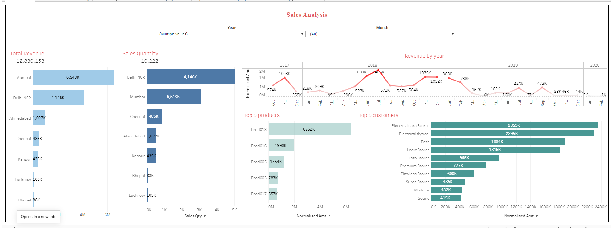

# Tableau_Sales_Analysis
Sales Analysis for the E-commerce Website Transactions where Customer orders have been studied by creating several sheets like 
1. Total Revenue
2. Total Sales Quantity
3. Revenue based on market
4. Sales quantity based on market
5. Year wise Revenue

Also, dropdown filters shown above the graphs for Year and Months helps to seggregates graphs. The top five products and the top 5 customers are shown based on the filters and the market choosed in the dashboard.
